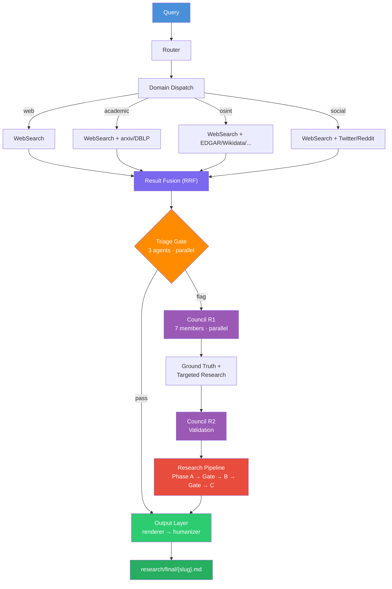
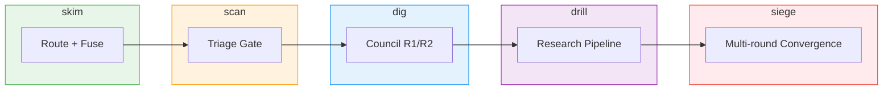
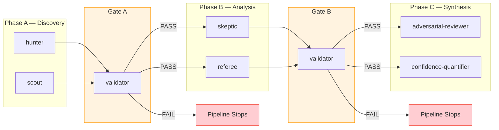
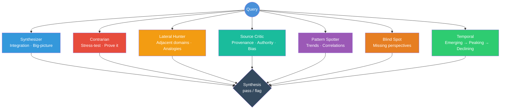

<p align="center">
  <h1 align="center">Seine Agentic Search Orchestrator</h1>
  <p align="center">
    Multi-domain search orchestration with deliberative council consensus,<br>phased research, and humanized output.
  </p>
</p>

<p align="center">
  <a href="https://github.com/adambkovacs/seine-agentic-search-orchestrator-plugin/blob/main/LICENSE"></a>
  
  
  
  
  
</p>

<p align="center">
  
  
  
  
</p>

---

## What This Is

Seine is a search orchestration engine that coordinates **20 specialized AI agents** to research questions thoroughly. Instead of a single search, Seine:

1. **Routes** your query to relevant domains (web, academic, OSINT, social)
2. **Triages** results with 3 gate agents that check completeness, quality, and gaps
3. **Deliberates** with a 7-member council providing diverse cognitive perspectives
4. **Researches** deeply with a phased pipeline: discovery, analysis, synthesis
5. **Renders** findings into prose with full source attribution and confidence scoring
6. **Humanizes** output through anti-slop filtering and voice styling

This plugin runs entirely inside Claude Code or Claude Cowork using built-in tools. **No external dependencies, no API keys, no shell scripts.**

---

## Features

<table>
<tr>
<td width="50%">

**Search Orchestration**
- 4 search domains (web, academic, OSINT, social)
- Reciprocal Rank Fusion across domain results
- 5 depth levels: skim, scan, dig, drill, siege
- Search craft KB with boolean operators and OSINT patterns

</td>
<td width="50%">

**Deliberative Council**
- 7-member council with distinct cognitive functions
- Triage gate (3 agents) for quality control
- Multi-round deliberation (R1 + R2 validation)
- Universal evidence vocabulary (SOLID/SOFT/SHAKY/UNKNOWN)

</td>
</tr>
<tr>
<td width="50%">

**Research Pipeline**
- Phased: Discovery -> Analysis -> Synthesis
- Validation gates between phases (PASS/FAIL)
- 7 research agents (hunter, scout, skeptic, referee, validator, adversarial-reviewer, confidence-quantifier)

</td>
<td width="50%">

**Output Layer**
- Mandatory Sources table with trust tiers
- Work Log documenting every pipeline stage
- Confidence Summary with per-claim scoring
- Anti-slop humanizer with 90%+ quality gate

</td>
</tr>
</table>

---

## Quick Start

### Install via Plugin Marketplace

```bash
/plugin marketplace add adambkovacs/seine-agentic-search-orchestrator-plugin
/plugin install seine
```

### Run your first search

```bash
# Quick scan (triage only)
/seine:seine-search "What are the latest developments in AI safety?" scan

# Deep analysis (triage + 7-member council)
/seine:seine-search "Impact of EU AI Act on startups" dig

# Full research (all 20 agents)
/seine:seine-research "Competitive landscape of AI code review tools"
```

---

## Installation

<details>
<summary><strong>Claude Code (Plugin Marketplace)</strong></summary>

```
/plugin marketplace add adambkovacs/seine-agentic-search-orchestrator-plugin
/plugin install seine
```

After installation, skills are available as:
```
/seine:seine-search "your query" dig
/seine:seine-council "your query"
/seine:seine-research "your query"
```
</details>

<details>
<summary><strong>Claude Code (Manual Install)</strong></summary>

Clone this repo and copy files into your project:

```bash
git clone https://github.com/adambkovacs/seine-agentic-search-orchestrator-plugin.git /tmp/seine-plugin

# Copy agents
cp /tmp/seine-plugin/agents/seine-*.md /path/to/your/project/.claude/agents/
mkdir -p /path/to/your/project/.claude/agents/seine-kb
cp /tmp/seine-plugin/agents/seine-kb/*.md /path/to/your/project/.claude/agents/seine-kb/

# Copy skills
for skill in seine-search seine-council seine-research; do
  mkdir -p /path/to/your/project/.claude/skills/$skill
  cp /tmp/seine-plugin/skills/$skill/SKILL.md /path/to/your/project/.claude/skills/$skill/
done
```
</details>

<details>
<summary><strong>Claude Cowork</strong></summary>

1. Navigate to **Plugins** in Claude Cowork settings
2. Search the marketplace for `seine` or add by repository URL:
   ```
   adambkovacs/seine-agentic-search-orchestrator-plugin
   ```
3. Click **Install**

Skills will be available in your Cowork sessions under the `seine` namespace.
</details>

<details>
<summary><strong>Manual Install (Any Claude Environment)</strong></summary>

Copy these directories into your project's `.claude/` folder:

| Source | Destination |
|--------|------------|
| `agents/seine-*.md` (20 files) | `.claude/agents/` |
| `agents/seine-kb/` (2 files) | `.claude/agents/seine-kb/` |
| `skills/seine-search/SKILL.md` | `.claude/skills/seine-search/SKILL.md` |
| `skills/seine-council/SKILL.md` | `.claude/skills/seine-council/SKILL.md` |
| `skills/seine-research/SKILL.md` | `.claude/skills/seine-research/SKILL.md` |
</details>

---

## Usage

### Three Skills

| Skill | Purpose | Depth |
|-------|---------|-------|
| `/seine:seine-search` | Multi-domain search with triage | Any (`skim` to `siege`) |
| `/seine:seine-council` | Deliberative council analysis | `dig`+ |
| `/seine:seine-research` | Full phased research pipeline | `drill`+ |

### Depth Guide

| Depth | Best For | Agents | Time |
|-------|----------|--------|------|
| `skim` | Quick fact checks | 0 | ~30s |
| `scan` | Surface-level overview | 3 (triage) | ~1-2min |
| `dig` | Thorough analysis | 10 (triage + council) | ~3-5min |
| `drill` | Deep investigation | 17 (+ research) | ~8-15min |
| `siege` | Exhaustive research | 20 (all, multi-round) | ~20-40min |

### Examples

```bash
# Quick scan
/seine:seine-search "Latest transformer architecture papers" scan

# Council deliberation for decisions
/seine:seine-council "Should we adopt GraphQL over REST for our API?"

# Deep research with full pipeline
/seine:seine-research "State of open-source LLMs for enterprise deployment"
```

---

## Architecture

### Pipeline Flow



### Depth Activation



### Research Pipeline Phases



### Council: 7 Cognitive Perspectives



See [docs/ARCHITECTURE.md](docs/ARCHITECTURE.md) for full agent schemas, output format, and research agent JSON envelope specification.

---

## Domains

| Domain | Description | Method | Sources |
|--------|-------------|--------|---------|
| **web** | General web search | `WebSearch` | Any web content |
| **academic** | Academic papers | `WebSearch` + site qualifiers | arXiv, DBLP, Semantic Scholar |
| **osint** | Open-source intelligence | `WebSearch` + specialized queries | EDGAR, OpenCorporates, Wikidata, LittleSis, OFAC, FEC, and more |
| **social** | Social media | `WebSearch` + platform targeting | Twitter/X, Reddit, LinkedIn |

The search craft knowledge base ([`agents/seine-kb/SEARCH-CRAFT.md`](agents/seine-kb/SEARCH-CRAFT.md)) includes:
- Boolean operators and exact phrase matching
- Site-restriction patterns for 13 OSINT sub-adapters
- Counter-evidence query construction
- Query expansion strategies and synonym tables
- WebFetch best practices and limitations

---

## Artifact Output

At `dig` depth and above, every query creates a persistent, auditable artifact directory:

```
research/artifacts/{query-slug}-{date}/
├── 00-query.json              # Routing decision + domains selected
├── 01-search-rounds/          # Per-domain raw results
├── 02-fusion.json             # RRF-fused results with scores
├── 03-triage/                 # 3 triage verdicts
├── 04-council-r1/             # 7 council member outputs
├── 05-research/               # Research phase outputs + gates
├── 06-council-r2/             # R2 outputs (if run)
├── 07-sources.json            # Deduplicated master source list
└── 08-timeline.json           # Per-stage timing
```

Final rendered output: `research/final/{slug}.md`

---

## Evidence Vocabulary

All agents use a universal 4-level evidence system:

| Label | Meaning | Score |
|-------|---------|-------|
| **SOLID** | Multiple independent sources, no contradictions | 1.0 |
| **SOFT** | Single credible source or indirect evidence | 0.6 |
| **SHAKY** | Single biased source or conflicting evidence | 0.3 |
| **UNKNOWN** | Insufficient evidence to assess | 0.0 |

**Confidence formula:** `(evidence x 0.40) + (source_quality x 0.25) + (recency x 0.20) + (agreement x 0.15)`

See [docs/EVIDENCE-VOCABULARY.md](docs/EVIDENCE-VOCABULARY.md) for source quality tiers and recency definitions.

---

## Agent Inventory

<table>
<tr><th>Category</th><th>Count</th><th>Agents</th></tr>
<tr><td><strong>Orchestrator</strong></td><td>1</td><td><code>researcher</code></td></tr>
<tr><td><strong>Output</strong></td><td>2</td><td><code>output-renderer</code> <code>humanizer</code></td></tr>
<tr><td><strong>Triage</strong></td><td>3</td><td><code>completeness</code> <code>quality</code> <code>gaps</code></td></tr>
<tr><td><strong>Council</strong></td><td>7</td><td><code>synthesizer</code> <code>contrarian</code> <code>lateral-hunter</code> <code>source-critic</code> <code>pattern-spotter</code> <code>blind-spot</code> <code>temporal</code></td></tr>
<tr><td><strong>Research</strong></td><td>7</td><td><code>hunter</code> <code>scout</code> <code>skeptic</code> <code>referee</code> <code>validator</code> <code>adversarial-reviewer</code> <code>confidence-quantifier</code></td></tr>
<tr><td><strong>Total</strong></td><td><strong>20</strong></td><td></td></tr>
</table>

Plus 2 knowledge base files and 3 skills.

---

## Requirements

| Requirement | Version |
|-------------|---------|
| Claude Code | v1.0.33+ |
| Claude Cowork | Any with plugin support |
| External dependencies | **None** |
| API keys | **None** |
| Environment variables | **None** |

---

## Updating

**Plugin Marketplace:**
```
/plugin update seine
```

**Manual:**
```bash
cd /tmp/seine-plugin && git pull
# Re-copy agents, KB, and skills as shown in manual installation above
```

---

## Contributing

Contributions are welcome. Please open an issue or pull request.

---

<p align="center">
  <sub>Built by <a href="https://github.com/adambkovacs">Adam Kovacs</a> at <a href="https://github.com/AI-Enablement-Academy">AI Enablement Academy</a></sub>
</p>

<p align="center">
  <a href="LICENSE">MIT License</a>
</p>
