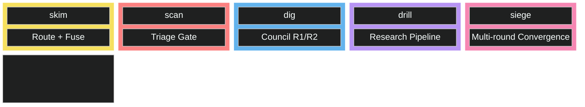
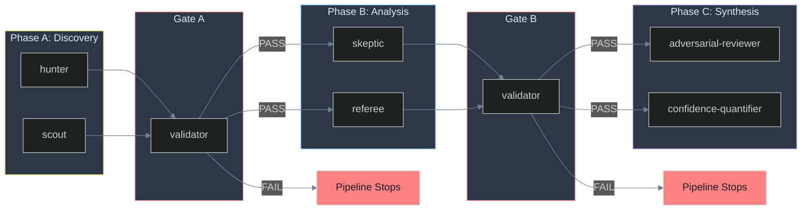
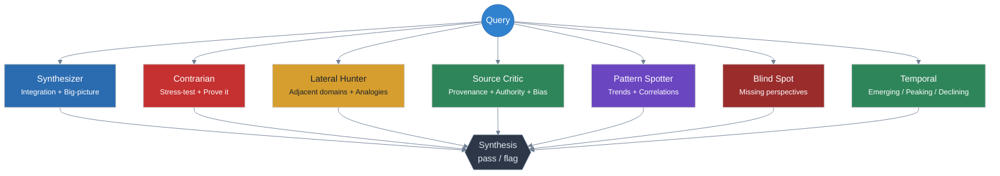

<p align="center">
  <h1 align="center">Seine</h1>
  <h3 align="center">Agentic search orchestration. 20 AI agents. Gated pipeline. Calibrated confidence.</h3>
  <p align="center">
    Single searches satisfice. Orchestrated agents converge on truth.
  </p>
</p>

<p align="center">
  <a href="https://github.com/adambkovacs/seine-agentic-search-orchestrator-plugin/blob/main/LICENSE"></a>
  
  
  
  
  
</p>

<p align="center">
  
  
  
  
</p>

---

A single AI search gives you one angle, one framing, and zero adversarial pressure. You have no way to know if the finding would survive basic scrutiny. Seine coordinates 20 specialized agents across a gated pipeline so that every claim is discovered, challenged, resolved, red-teamed, and confidence-scored before it reaches you.

**No dependencies. No API keys. No shell scripts.** Runs entirely inside Claude Code or Claude Cowork using built-in tools.

## Quick Start

```bash
# Install
/plugin marketplace add adambkovacs/seine-agentic-search-orchestrator-plugin
/plugin install seine

# Run
/seine:seine-search "Impact of EU AI Act on startups" dig
```

---

## What a Report Looks Like

A `drill`-depth run on EU AI Act produced this (abridged):

```markdown
# EU AI Act vs US AI Regulation: Comparative analysis

> Pipeline: drill | 4 search rounds | 34 sources | 7 council members
> Evidence: SOLID (verified) | SOFT (single source) | SHAKY (weak) | UNKNOWN

The EU AI Act classifies AI systems into four risk tiers [1] [Source-Critic: SOLID]:
unacceptable (banned outright), high-risk (strict compliance), limited (transparency
obligations), and minimal (no specific rules).

The EU AI Act's GPAI 10^25 FLOPs threshold operates as a rebuttable presumption,
not a hard ceiling, but the adversarial reviewer found that the inverse burden of
proof makes practical rebuttal difficult. [4] [Adversarial: SOFT]

The Trump executive order's claim to preempt state AI laws was downgraded from SOFT
to SHAKY by the adversarial reviewer. The EO lacks self-executing legal authority. [6] [9]

## Sources & References
| # | Title | Trust | Cited By |
|---|-------|-------|----------|
| 1 | EUR-Lex: Regulation 2024/1689 | HIGH | hunter, skeptic, referee |
| 2 | EU AI Office: Implementation Timeline | HIGH | hunter, scout |

## Confidence Summary
| Claim | Label | Sources | Score |
|-------|-------|---------|-------|
| 4-tier risk classification | SOLID | 8 | 0.92 |
| No US federal comprehensive AI law | SOLID | 5 | 0.87 |
| Trump EO federal preemption | SHAKY | 3 | 0.34 |
```

Every claim carries a `[N]` source link. Council members who challenged a finding are cited inline with their evidence label.

---

## How It Works

### Depth Activation



### Research Pipeline Phases



### Council: 7 Cognitive Perspectives



---

<details>
<summary><strong>Features</strong></summary>

| | |
|---|---|
| **Search** | 4 domains (web, academic, OSINT, social), Reciprocal Rank Fusion, 5 depth levels, boolean query construction, counter-evidence generation |
| **Council** | 7-member deliberative council, triage gate (3 agents), multi-round deliberation (R1 + R2) |
| **Research** | 3-phase gated pipeline (Discovery, Analysis, Synthesis), 7 research agents, validation gates that stop on FAIL |
| **Output** | Mandatory source tables with trust tiers, inline citations, confidence scores per claim, anti-slop humanizer (90%+ quality gate) |
| **OSINT** | 13 query patterns for SEC/EDGAR, OpenCorporates, Wikidata, LittleSis, OFAC, FEC, CompaniesHouse, CANDID, court records, patents, news, sanctions, property (all via `WebSearch` with `site:` targeting, no API keys) |

</details>

<details>
<summary><strong>Installation</strong></summary>

**Claude Code (Marketplace):**
```bash
/plugin marketplace add adambkovacs/seine-agentic-search-orchestrator-plugin
/plugin install seine
```

**Claude Cowork:** Search the marketplace for `seine` or add by repo URL: `adambkovacs/seine-agentic-search-orchestrator-plugin`

**Manual install:** Clone this repo and copy `agents/seine-*.md` to `.claude/agents/`, `agents/seine-kb/` to `.claude/agents/seine-kb/`, and each `skills/seine-*/SKILL.md` to `.claude/skills/seine-*/SKILL.md`.

</details>

<details>
<summary><strong>Usage & Depth Guide</strong></summary>

### Three Skills

| Skill | Purpose | Depth |
|-------|---------|-------|
| `/seine:seine-search` | Multi-domain search with triage | Any (`skim` to `siege`) |
| `/seine:seine-council` | Deliberative council analysis | `dig`+ |
| `/seine:seine-research` | Full phased research pipeline | `drill`+ |

### Depth Guide

| Depth | Best For | Agents | Time |
|-------|----------|--------|------|
| `skim` | Quick fact checks | 0 | ~30s |
| `scan` | Surface-level overview | 3 (triage) | ~1-2min |
| `dig` | Thorough analysis | 10 (triage + council) | ~3-5min |
| `drill` | Deep investigation | 17 (+ research) | ~8-15min |
| `siege` | Exhaustive research | 20 (all, multi-round) | ~20-40min |

### Examples

```bash
# Quick scan
/seine:seine-search "Latest transformer architecture papers" scan

# Council deliberation for decisions
/seine:seine-council "Should we adopt GraphQL over REST for our API?"

# Deep research with full pipeline
/seine:seine-research "State of open-source LLMs for enterprise deployment"
```

</details>

<details>
<summary><strong>Use Cases</strong></summary>

- **Regulatory compliance** (`drill`/`siege`): Multi-jurisdiction analysis with enforcement timelines, penalty structures, and carve-outs. OSINT patterns pull from official registries.
- **Competitive intelligence** (`dig`/`drill`): Cross-references vendor claims against independent sources. Source Critic + Contrarian separate marketing from reality.
- **Due diligence** (`drill`/`siege`): Entity research across EDGAR, OpenCorporates, LittleSis, OFAC, FEC, court records, Wikidata, and more, all in parallel.
- **Technical architecture decisions** (`dig`/`drill`): Trade-off analysis with Lateral Hunter finding analogous decisions in adjacent fields.
- **Academic literature review** (`drill`): arXiv + DBLP simultaneously, Skeptic surfaces null results and replication failures alongside confirmatory findings.
- **Fact-checking** (`dig`/`drill`): Negation queries, per-source confidence tables, Blind Spot asks who is absent from the analysis.
- **Market entry** (`siege`): Multi-round convergence across all domains. Full auditable artifact directory.
- **Grant/proposal research** (`drill`): Evidence base with confidence labels, surfaces counter-evidence the proposal should address.

</details>

<details>
<summary><h3>Skills Reference (3 skills)</h3></summary>

<details>
<summary><strong>seine-search</strong> - Multi-domain search with triage</summary>

Routes a query to 2-4 domains, dispatches in parallel, fuses with Reciprocal Rank Fusion, runs triage. At `dig`+ writes artifacts and calls downstream skills.

```
/seine:seine-search <query> [depth]
```

| Depth | What runs | Artifacts |
|-------|-----------|-----------|
| `skim` | Route + fuse only | No |
| `scan` | + 3 triage agents | No |
| `dig` | + Full council (7 members) | Yes |
| `drill` | + Research pipeline | Yes |
| `siege` | + Research with Opus, multi-round | Yes |

</details>

<details>
<summary><strong>seine-council</strong> - Deliberative council analysis</summary>

Runs 7 council specialists on search results. Each runs independently in R1. Synthesizer consolidates in R2. At `dig`+, targeted research fills gaps between rounds.

```
/seine:seine-council triage   <query> <results_json>
/seine:seine-council deliberate <query> <results_json>
```

| Mode | Agents | When |
|------|--------|------|
| `triage` | 3 (completeness, quality, gaps) | Quick quality gate |
| `deliberate` | 7 members + R2 synthesis | `dig`+ |

</details>

<details>
<summary><strong>seine-research</strong> - Full phased research pipeline</summary>

Three-phase pipeline with validation gates. A FAIL stops immediately.

```
/seine:seine-research <query> [depth]
```

| Depth | Model | Use when |
|-------|-------|---------|
| `drill` | Sonnet | Standard deep research |
| `siege` | Opus | Maximum rigor |

```
Phase A: hunter + scout → Gate A → Phase B: skeptic + referee → Gate B → Phase C: adversarial + confidence
```

All agents output the ADR-S007 schema: `scope`, `findings`, `counter_evidence`, `confidence_table`, `gaps`, `sources`.

</details>

See [docs/ARCHITECTURE.md](docs/ARCHITECTURE.md) for full specs. See [docs/EVIDENCE-VOCABULARY.md](docs/EVIDENCE-VOCABULARY.md) for the confidence formula.

</details>

<details>
<summary><strong>Domains & Search Craft</strong></summary>

### Domains

| Domain | Method | Targets |
|--------|--------|---------|
| **web** | `WebSearch` | Any web content |
| **academic** | `WebSearch` + `site:` qualifiers | arXiv, DBLP, Semantic Scholar |
| **osint** | `WebSearch` + `site:` targeting | SEC/EDGAR, OpenCorporates, Wikidata, OFAC, etc. |
| **social** | `WebSearch` + platform targeting | Twitter/X, Reddit, LinkedIn |

All OSINT queries use Claude Code's built-in `WebSearch` with `site:` restriction patterns. No external API keys or direct database connections.

### Search Craft

Every query decomposes into three variants: direct query, angle shift, and counter-evidence query. Examples:

```
# Direct
"EU AI Act Article 4" site:eur-lex.europa.eu

# Angle shift (hiring signals instead of press releases)
"Delivery Hero" site:linkedin.com/jobs "machine learning"

# Counter-evidence
"Delivery Hero" "cost cutting" OR "layoffs" 2026
```

**Multi-round search:** Seine treats search as a spiral. Round 1 establishes baseline, Round 2 fills gaps, Round 3 challenges findings, Round 4 finds adjacent signals, Round 5 tracks temporal changes. At `siege`, this loops until convergence (capped at 10 rounds).

**Source quality:** Trust tiers assigned at query time: `.gov` and peer-reviewed = HIGH, Reuters/Bloomberg = MEDIUM-HIGH, industry reports = MEDIUM, Reddit/forums = LOW, anonymous = DISQUALIFIED.

See [agents/seine-kb/SEARCH-CRAFT.md](agents/seine-kb/SEARCH-CRAFT.md) for the full query pattern library.

</details>

<details>
<summary><strong>Evidence Vocabulary</strong></summary>

| Label | Meaning | Score |
|-------|---------|-------|
| **SOLID** | Multiple independent sources, no contradictions | 1.0 |
| **SOFT** | Single credible source or indirect evidence | 0.6 |
| **SHAKY** | Single biased source or conflicting evidence | 0.3 |
| **UNKNOWN** | Insufficient evidence to assess | 0.0 |

**Confidence formula:** `(evidence x 0.40) + (source_quality x 0.25) + (recency x 0.20) + (agreement x 0.15)`

**Anti-hallucination (6 overlapping mechanisms):**
1. **Source Critic** scrutinizes credibility before claims are built on sources
2. **Contrarian + Skeptic** construct the case against each finding with active counter-evidence searches
3. **Referee** issues binding verdicts on conflicts with explicit source quality comparisons
4. **Adversarial Reviewer** red-teams via 5-step protocol: steelman, attack, negate, fail scenarios, correct
5. **Confidence Quantifier** scores every claim on 4 dimensions
6. **Pipeline gates** stop the run if aggregate confidence falls below threshold

No single agent's judgment is trusted. Every claim must survive independent discovery, adversarial analysis, conflict resolution, red-team attack, and calibrated scoring.

</details>

<details>
<summary><h3>Agents (20 total)</h3></summary>

| Category | Count | Agents |
|----------|-------|--------|
| **Orchestrator** | 1 | `researcher` |
| **Output** | 2 | `output-renderer`, `humanizer` |
| **Triage** | 3 | `completeness`, `quality`, `gaps` |
| **Council** | 7 | `synthesizer`, `contrarian`, `lateral-hunter`, `source-critic`, `pattern-spotter`, `blind-spot`, `temporal` |
| **Research** | 7 | `hunter`, `scout`, `skeptic`, `referee`, `validator`, `adversarial-reviewer`, `confidence-quantifier` |

Plus 2 knowledge base files and 3 skills.

<details>
<summary><strong>Triage agents (3)</strong></summary>

Run at `scan`+ in parallel after fusion. A single flag triggers additional search rounds or escalates to council.

**Completeness** checks whether all relevant domains were queried. Flags missing domains with a specific sub-query.

```json
{ "agent": "completeness", "verdict": "flag",
  "reason": "Query is about SEC filings but 'osint' domain was not searched.",
  "action": { "type": "search_domain", "domain": "osint", "subquery": "Delivery Hero 10-K SEC annual report 2025" } }
```

**Quality** checks whether top results actually answer the query, not just match keywords.

```json
{ "agent": "quality", "verdict": "flag",
  "reason": "Top 4 results are marketing blog summaries, not compliance guidance.",
  "action": { "type": "refine_query", "subquery": "EU AI Act SME obligations Article 9 compliance steps 2025" } }
```

**Gaps** identifies what is conspicuously absent. A flag routes directly to council deliberation (highest-stakes triage agent).

```json
{ "agent": "gaps", "verdict": "flag",
  "reason": "All 8 results represent the vendor perspective. No regulator or civil society sources.",
  "action": { "type": "search_domain", "domain": "web", "subquery": "EU AI Act criticism civil society NGO response 2025" } }
```

</details>

<details>
<summary><strong>Council agents (7)</strong></summary>

All seven run in parallel at `dig`+. None sees another member's output. A flag triggers R2 with targeted research between rounds.

| Member | Role |
|--------|------|
| **Contrarian** | Assumes top result is wrong, builds the case against it. Only endorses after failing to break a claim. |
| **Lateral Hunter** | Searches adjacent fields. "AI compliance costs" -> checks pharma GMP compliance literature for validated SME cost models. |
| **Blind Spot** | Asks what nobody asked. Five absence types: population, time, discipline, scale, incentive. |
| **Temporal** | Maps trajectory over time. Classifies life stage (emerging/growing/peaking/declining). Flags stale results. |
| **Source Critic** | Checks bylines before content. Trust tier assignments feed directly into final confidence scores. |
| **Pattern Spotter** | "4 of 8 results cite X" (never "several results suggest"). Surfaces convergence and contradictions. |
| **Synthesizer** | Runs last. Finds the unifying thread, names the connecting principle in one sentence. |

</details>

<details>
<summary><strong>Research pipeline agents (8)</strong></summary>

Three-phase sequence with validation gates. All agents in the same phase run in parallel.

| Agent | Phase | Role |
|-------|-------|------|
| **Hunter** | A (Discovery) | Catalogs claims, clusters thematically, builds `evidence_map` |
| **Scout** | A (Discovery) | Reads low-ranked results for non-obvious signals, `adjacent_signals`, `timing_triggers` |
| **Validator** | Gates A/B | Schema check + confidence threshold (0.70 for A, 0.75 for B). Missing block = FAIL. |
| **Skeptic** | B (Analysis) | Tests claims by searching for counter-evidence. Classifies: survived/collapsed/weakened |
| **Referee** | B (Analysis) | Binding verdicts on conflicts. Source quality wins. Four verdicts: affirmed/rejected/qualified/indeterminate |
| **Adversarial Reviewer** | C (Synthesis) | 5-step red-team: steelman, attack, negate, fail scenarios, correct |
| **Confidence Quantifier** | C (Synthesis) | Scores on 4 dimensions. Flags over-confidence and mechanical scoring. |

</details>

<details>
<summary><strong>Output agents (2)</strong></summary>

**Output Renderer:** Transforms artifacts into prose with `[N]` citations, `[Member: LABEL]` attributions, Sources table, Work Log, Confidence Summary.

**Humanizer:** 5-tier anti-slop audit. Tier 1 violations (em dashes, emoji) cost 10 points each. Threshold: 90/100. Structured data is never touched.

</details>

</details>

<details>
<summary><strong>Artifact Output</strong></summary>

At `dig`+ every query creates a persistent artifact directory:

```
research/artifacts/{query-slug}-{date}/
├── 00-query.json              # Routing decision + domains selected
├── 01-search-rounds/          # Per-domain raw results
├── 02-fusion.json             # RRF-fused results with scores
├── 03-triage/                 # 3 triage verdicts
├── 04-council-r1/             # 7 council member outputs
├── 05-research/               # Research phase outputs + gates
├── 06-council-r2/             # R2 outputs (if run)
├── 07-sources.json            # Deduplicated master source list
└── 08-timeline.json           # Per-stage timing
```

Final rendered output: `research/final/{slug}.md`

</details>

<details>
<summary><strong>Requirements & Updating</strong></summary>

| Requirement | Version |
|-------------|---------|
| Claude Code | v1.0.33+ |
| Claude Cowork | Any with plugin support |
| External dependencies | **None** |
| API keys | **None** |

**Update via marketplace:**
```bash
/plugin update seine
```

**Update manually:**
```bash
cd /tmp/seine-plugin && git pull
# Re-copy agents, KB, and skills
```

</details>

---

## Contributing

Contributions welcome. Please open an issue or pull request.

---

<p align="center">
  <sub>Built by <a href="https://github.com/adambkovacs">Adam Kovacs</a> at <a href="https://github.com/AI-Enablement-Academy">AI Enablement Academy</a></sub>
</p>

<p align="center">
  <a href="LICENSE">MIT License</a>
</p>
