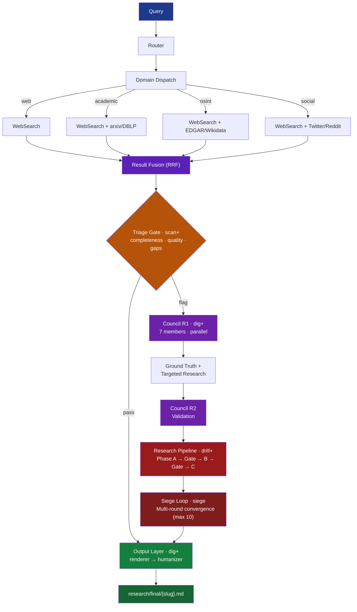
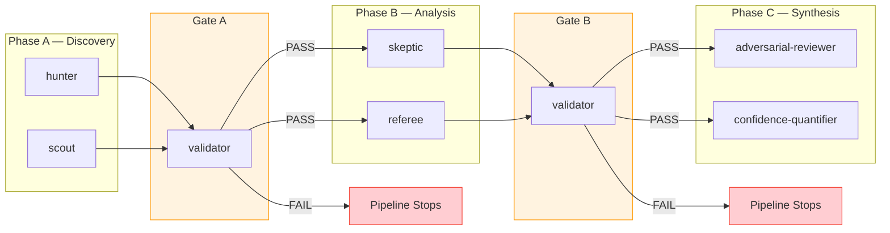
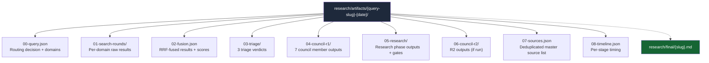

# Seine Architecture

## Pipeline Overview

Seine processes queries through a depth-controlled pipeline. Deeper depths activate more agents and produce more thorough analysis.



## Depth Behavior

| Depth | What Activates | Sources Reviewed | Expected Findings | Analysis Intensity |
|-------|---------------|-----------------|-------------------|-------------------|
| skim | Route + Fuse only | -- | -- | None (no agents) |
| scan | + Triage council (3 agents) | Top 3 results | 1-2 findings | Surface-level |
| dig | + Full council (7 members) | Top 10 results | 3-5 findings | Moderate |
| drill | + Research pipeline (7 agents) | All results | 5-8 findings | Deep analysis |
| siege | + Research with opus models | Exhaustive + adjacent | 8+ findings | Maximum rigor |

## Agent Inventory

### Triage Agents (3) -- Gate at scan+

| Agent | Question | Action on Flag |
|-------|----------|----------------|
| **completeness** | Were all relevant domains searched? | Request missing domain search |
| **quality** | Do results actually answer the query? | Suggest refined query |
| **gaps** | What's conspicuously absent? | Escalate to full council |

### Council Members (7) -- Parallel at dig+

| Member | Cognitive Function | Key Behavior |
|--------|-------------------|-------------|
| **synthesizer** | Integration, big-picture | Finds unifying narrative across domains |
| **contrarian** | Adversarial stress-test | Assumes top result is wrong, applies "prove it" / "so what?" |
| **lateral-hunter** | Adjacent-domain search | Finds structural analogies from unexpected fields |
| **source-critic** | Provenance evaluation | Checks recency, authority, bias, citation quality |
| **pattern-spotter** | Cross-domain correlation | Finds themes, emerging trends, contradictions between domains |
| **blind-spot** | Missing-perspective detection | "What questions haven't been asked?" |
| **temporal** | Time-trajectory analysis | Maps emerging -> growing -> peaking -> declining trajectories |

### Research Agents (7) -- Phased at drill+

| Agent | Mission | Phase | Output |
|-------|---------|-------|--------|
| **hunter** | Build strongest evidence base | A (Discovery) | Evidence Map + Confidence Table |
| **scout** | Find non-obvious signals | A (Discovery) | Adjacent/Weak Signals + Timing Triggers |
| **skeptic** | Challenge claims with negation queries | B (Analysis) | Claim-by-Claim Challenge + Survived Claims |
| **referee** | Resolve conflicting evidence | B (Analysis) | Verdict + Source Quality Comparison |
| **validator** | Phase gate quality check | Gate | PASS / PASS WITH NOTES / FAIL |
| **adversarial-reviewer** | Red-team final analysis | C (Synthesis) | Weaknesses + Failure Scenarios + Corrections |
| **confidence-quantifier** | Calibrate confidence scores | C (Synthesis) | Per-finding scoring |

### Output Agents (2) -- Post-pipeline at dig+

| Agent | Purpose |
|-------|---------|
| **output-renderer** | Transform JSON artifacts into prose with Sources, Work Log, Confidence Summary |
| **humanizer** | Anti-slop audit + voice application + quality gate (NO-SLOP > 90%) |

### Orchestrator (1)

| Agent | Purpose |
|-------|---------|
| **researcher** | Main orchestrator for deep research runs. Coordinates all pipeline stages. |

## Domains

| Domain | Description | Method |
|--------|-------------|--------|
| **web** | General web search | WebSearch |
| **academic** | arXiv and DBLP papers | WebSearch with qualifiers |
| **osint** | EDGAR, OpenCorporates, Wikidata, LittleSis, OFAC, FEC, and more | WebSearch with specialized queries |
| **social** | Twitter/X, Reddit, LinkedIn | WebSearch on social platforms |

## Council Output Schema

All 7 council members produce the same JSON structure:

```json
{
  "member": "<name>",
  "findings": [
    {
      "type": "endorsement|challenge|gap|pattern|recommendation",
      "target_rank": null,
      "detail": "specific finding text",
      "evidence_label": "SOLID|SOFT|SHAKY|UNKNOWN",
      "action": null
    }
  ],
  "summary": "2-3 sentence overall assessment",
  "verdict": "pass|flag"
}
```

## Research Agent Schema (6 Required Blocks)

```json
{
  "scope": { "query": "...", "depth": "...", "agent": "...", "timestamp": "ISO-8601" },
  "findings": [{ "type": "...", "detail": "...", "evidence_label": "...", "source": "..." }],
  "counter_evidence": [{ "claim": "...", "counter": "...", "evidence_label": "..." }],
  "confidence_table": [{ "claim": "...", "evidence_label": "...", "source_count": 0 }],
  "gaps": ["..."],
  "sources": [{ "url": "...", "title": "...", "trust_tier": "HIGH|MEDIUM|LOW|DISQUALIFIED" }]
}
```

## Research Pipeline Detail



## Artifact Directory Structure

At `dig` depth and above, each query creates a persistent artifact directory:


