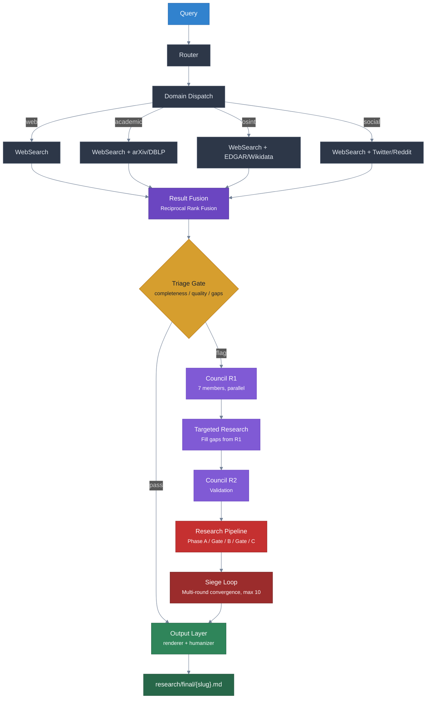
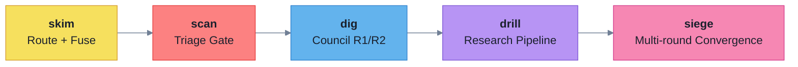
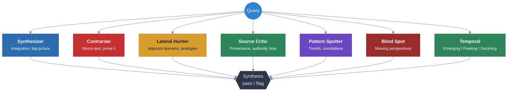
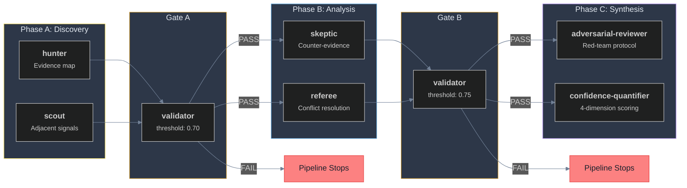

# Seine Architecture

## Pipeline Overview

Seine processes queries through a depth-controlled pipeline. Each depth level activates more agents and produces deeper analysis.



---

## Depth Behavior



| Depth | What Activates | Sources Reviewed | Findings | Intensity |
|-------|---------------|-----------------|----------|-----------|
| **skim** | Route + Fuse only | -- | -- | None |
| **scan** | + 3 triage agents | Top 3 | 1-2 | Surface |
| **dig** | + 7 council members | Top 10 | 3-5 | Moderate |
| **drill** | + 7 research agents | All results | 5-8 | Deep |
| **siege** | + Opus models, multi-round | Exhaustive + adjacent | 8+ | Maximum |

---

## Agent Inventory

### Triage (3 agents, `scan`+)

| Agent | Question It Answers | On Flag |
|-------|-------------------|---------|
| **completeness** | Were all relevant domains searched? | Request missing domain |
| **quality** | Do results answer the query? | Refine query |
| **gaps** | What is conspicuously absent? | Escalate to council |

### Council (7 members, `dig`+, parallel)



### Research Pipeline (7 agents, `drill`+)



### Output (2 agents, `dig`+)

| Agent | Purpose |
|-------|---------|
| **output-renderer** | Transforms JSON artifacts into prose with `[N]` citations, Sources table, Work Log, Confidence Summary |
| **humanizer** | 5-tier anti-slop audit (threshold: 90/100) + voice styling. Structured data is never touched. |

### Orchestrator (1)

| Agent | Purpose |
|-------|---------|
| **researcher** | Coordinates all pipeline stages. Generates slug, creates artifact directory, routes between skills. Runs on Opus. |

---

## Domains

| Domain | Method | What It Searches |
|--------|--------|-----------------|
| **web** | `WebSearch` | General web content |
| **academic** | `WebSearch` + `site:` qualifiers | arXiv, DBLP, Semantic Scholar |
| **osint** | `WebSearch` + `site:` targeting | SEC/EDGAR, OpenCorporates, Wikidata, OFAC, FEC, LittleSis, CompaniesHouse, CANDID, court records, patents, news, sanctions, property |
| **social** | `WebSearch` + platform targeting | Twitter/X, Reddit, LinkedIn |

All OSINT uses `WebSearch` with `site:` restriction patterns. No external API keys or database connections.

---

## Output Schemas

<details>
<summary><strong>Council Member Output</strong></summary>

```json
{
  "member": "<name>",
  "findings": [
    {
      "type": "endorsement|challenge|gap|pattern|recommendation",
      "target_rank": null,
      "detail": "specific finding text",
      "evidence_label": "SOLID|SOFT|SHAKY|UNKNOWN",
      "action": null
    }
  ],
  "summary": "2-3 sentence overall assessment",
  "verdict": "pass|flag"
}
```

</details>

<details>
<summary><strong>Research Agent Output (ADR-S007, 6 required blocks)</strong></summary>

```json
{
  "scope": { "query": "...", "depth": "...", "agent": "...", "timestamp": "ISO-8601" },
  "findings": [{ "type": "...", "detail": "...", "evidence_label": "...", "source": "..." }],
  "counter_evidence": [{ "claim": "...", "counter": "...", "evidence_label": "..." }],
  "confidence_table": [{ "claim": "...", "evidence_label": "...", "source_count": 0 }],
  "gaps": ["..."],
  "sources": [{ "url": "...", "title": "...", "trust_tier": "HIGH|MEDIUM|LOW|DISQUALIFIED" }]
}
```

</details>

---

## Artifact Directory

At `dig`+ every query creates a persistent, auditable artifact directory:

```mermaid
%%{init: {'theme': 'dark', 'themeVariables': {'primaryColor': '#2D3748', 'primaryTextColor': '#E2E8F0', 'lineColor': '#718096'}}}%%
graph TD
    ROOT["research/artifacts/{slug}-{date}/"] --> Q0["00-query.json<br/><small>Routing + domains</small>"]
    ROOT --> S1["01-search-rounds/<br/><small>Per-domain raw results</small>"]
    ROOT --> F2["02-fusion.json<br/><small>RRF-fused + scores</small>"]
    ROOT --> T3["03-triage/<br/><small>3 verdicts</small>"]
    ROOT --> C4["04-council-r1/<br/><small>7 member outputs</small>"]
    ROOT --> R5["05-research/<br/><small>Phase outputs + gates</small>"]
    ROOT --> C6["06-council-r2/<br/><small>R2 outputs</small>"]
    ROOT --> S7["07-sources.json<br/><small>Master source list</small>"]
    ROOT --> T8["08-timeline.json<br/><small>Per-stage timing</small>"]
    ROOT -.-> FINAL["research/final/{slug}.md"]

    style ROOT fill:#2D3748,color:#E2E8F0,stroke:#718096
    style Q0 fill:#2D3748,color:#E2E8F0,stroke:#4A5568
    style S1 fill:#2D3748,color:#E2E8F0,stroke:#4A5568
    style F2 fill:#6B46C1,color:#fff,stroke:#553C9A
    style T3 fill:#D69E2E,color:#1A202C,stroke:#B7791F
    style C4 fill:#805AD5,color:#fff,stroke:#6B46C1
    style R5 fill:#C53030,color:#fff,stroke:#9B2C2C
    style C6 fill:#805AD5,color:#fff,stroke:#6B46C1
    style S7 fill:#2F855A,color:#fff,stroke:#276749
    style T8 fill:#2D3748,color:#E2E8F0,stroke:#4A5568
    style FINAL fill:#276749,color:#fff,stroke:#22543D
```



---

## Evidence Vocabulary

| Label | Meaning | Score |
|-------|---------|-------|
| **SOLID** | Multiple independent sources, no contradictions | 1.0 |
| **SOFT** | Single credible source or indirect evidence | 0.6 |
| **SHAKY** | Single biased source or conflicting evidence | 0.3 |
| **UNKNOWN** | Insufficient evidence to assess | 0.0 |

**Confidence formula:**

```
confidence = (evidence x 0.40) + (source_quality x 0.25) + (recency x 0.20) + (agreement x 0.15)
```

| Composite Score | Label |
|----------------|-------|
| >= 0.80 | SOLID |
| >= 0.55 | SOFT |
| >= 0.30 | SHAKY |
| < 0.30 | UNKNOWN |

**Source quality tiers:** HIGH (`.gov`, peer-reviewed) > MEDIUM-HIGH (Reuters, Bloomberg) > MEDIUM (industry reports) > LOW (forums, unvetted blogs) > DISQUALIFIED (anonymous, no attribution)

**Recency tiers:** CURRENT (< 30d) > RECENT (30-180d) > DATED (180-365d) > STALE (> 365d)
